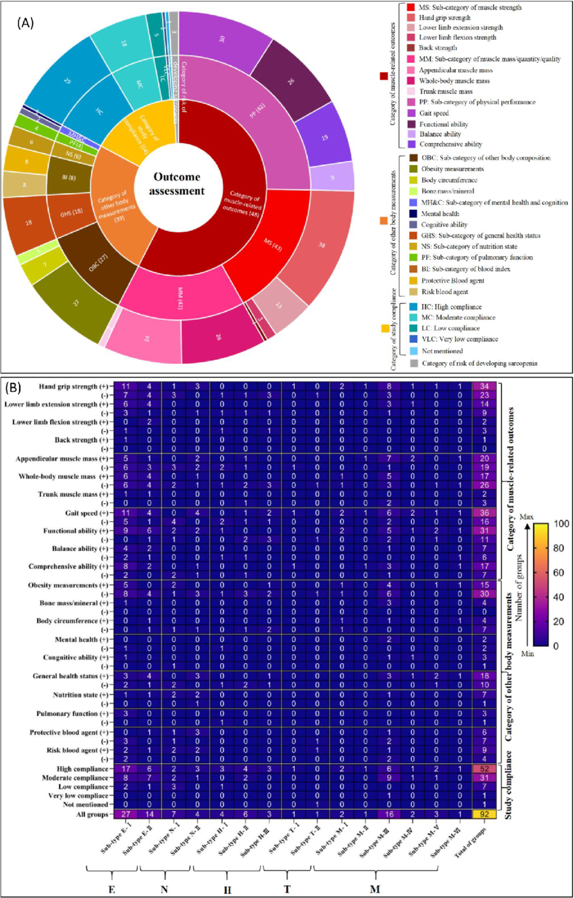

# 📸 **Jornada Visual - Python Data Driven Visualization Journey**

Uma documentação visual completa da evolução dos dashboards, desde as referências iniciais até os resultados finais.

## 🎨 **Referências Visuais Iniciais**

### **Imagem de Referência 1: Sunburst Hierárquico**

**Características Analisadas:**
- Estrutura hierárquica com múltiplos níveis
- Paleta de cores harmoniosa
- Labels informativos em cada segmento
- Centro com informação agregada
- Tooltips detalhados

**Aplicação no Projeto:**
- Base para V1 - Dashboard Simples
- Inspiração para estrutura de dados do V2
- Padrão de cores usado em todas as versões

---

### **Imagem de Referência 2: Análise Científica**

**Características Analisadas:**
- Heatmap com correlações
- Gráficos múltiplos coordenados
- Interface científica profissional
- Análise estatística integrada
- Layout responsivo

**Aplicação no Projeto:**
- Inspiração para V3 - Machine Learning
- Base para análise de correlações
- Design de interface profissional
- Integração de múltiplas visualizações

---

### **Imagem de Referência 3: Dashboard Comercial**

**Características Analisadas:**
- Sunburst com dados comerciais
- Métricas centralizadas (2,253K Total Sales)
- Hierarquia clara: Technology > Office Supplies > Furniture
- Percentuais bem distribuídos
- Interface limpa e profissional

**Aplicação no Projeto:**
- Modelo para estrutura de dados do V2
- Base para métricas centralizadas
- Inspiração para tooltips informativos
- Padrão de hierarquia aplicado

---

## 🚀 **Evolução do Desenvolvimento**

### **Processo de Inspiração → Implementação**

```mermaid
graph TD
    A[Referências Visuais] --> B[Análise de Estruturas]
    B --> C[Extração de Dados HTML]
    C --> D[V1 - Prova de Conceito]
    D --> E[V2 - Filtros Avançados]
    E --> F[V3 - ML + Complexidade]
    F --> G[Três Dashboards Funcionais]
```

### **Resultado Final: Screenshots da Evolução**

**O que vemos neste screenshot:**
1. **Lado Esquerdo**: Terminal mostrando execução bem-sucedida dos códigos
2. **Centro Superior**: V2 Construction Dashboard rodando na porta 8050
3. **Lado Direito**: V3 Smart Home Dashboard rodando na porta 8053
4. **Interface Integrada**: Todos os dashboards funcionando simultaneamente

---

## 📊 **Comparação: Antes vs Depois**

| Aspecto | Referências | V1 Simple | V2 Construction | V3 Smart Home |
|---------|-------------|-----------|-----------------|---------------|
| **Complexidade** | Inspiração | Básica | Média | Alta |
| **Interatividade** | Estática | Mínima | Filtros | ML + Mapas |
| **Dados** | Exemplo | Reais | Estruturados | Preditivos |
| **Visualizações** | 1 tipo | 1 tipo | 1 tipo | 4 tipos |
| **Tecnologia** | HTML/JS | Dash Basic | Dash + Callbacks | Dash + ML |

---

## 🎯 **Lições da Jornada Visual**

### **✅ O que Funcionou**
1. **Referências Claras**: Ter modelos visuais definidos desde o início
2. **Análise Detalhada**: Estudar características específicas de cada referência
3. **Implementação Incremental**: Evoluir gradualmente de simples para complexo
4. **Documentação Visual**: Registrar cada etapa com screenshots

### **📚 Aprendizados para Futuros Projetos**
1. Sempre começar com referências visuais sólidas
2. Extrair dados reais de fontes funcionais
3. Testar cada evolução antes de avançar
4. Documentar visualmente todo o processo
5. Manter backup de todas as versões funcionais

---

## 🔗 **Links Relacionados**

- [Documentação Principal](../README.md)
- [Assets e Recursos](../assets/README.md)
- [Relatórios de Erro](../error_reports/)
- [Guias de IA](../ai_learning_guides/)

---

*Jornada visual documentada para inspirar futuros desenvolvimentos e servir como referência de boas práticas*
